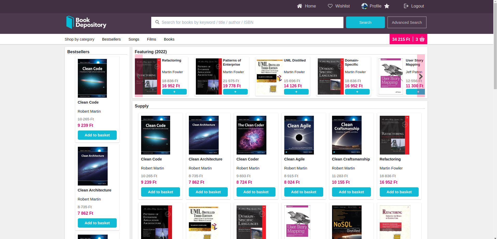

# Bookshop

Bookshop site in React (redux) + NodeJS + Express + Oracle

### Disclaimer!

The design of the page was taken from the https://www.bookdepository.com/. This project was created for only educational purposes. We do **NOT** intend to produce any commercial content from this!

### Insights

Home page



More: [documentation/screenshots](https://github.com/LeventeWolf/Bookshop/tree/master/documentation/screenshots)


## Setup & Run

### Prerequisites:
Client & Server
- NodeJS version: 16
- Web browser: Chrome, Mozilla firefox,

Database
- Docker
- Oracle [db] version: oracle-12c
- Xampp

<hr>

### Installation

#### React & Nodejs
To install the dependencies go to /client & /server then run: <br>

`npm install`

#### Oracle

Detailed installation: https://github.com/MaksymBilenko/docker-oracle-12c

1. Download docker image:  <br>
    ```
    docker pull truevoly/oracle-12c
    ```

2. Download **oracle-client** [Version 19.14.0.0.0] <br>
    https://www.oracle.com/database/technologies/instant-client/linux-x86-64-downloads.html <br>
    [Windows/MacOS]: Change `libPath` variable in **server/setup.js** to your downloaded oracle-client path

    [Linux]: export to path 
    ```
    PATH="$PATH:/your/path/to/instantclient_19_14";export PATH
    ```
[3. Xampp php.ini enable oci8 - ?not relevant?]
 
<hr>

### Run

#### Webserver

/server -> `npm start`

#### Client

/client -> `npm start`

#### Database

##### Run docker image
**[Windows]:** <br> 
Start oracle-12c in your Docker desktop app

**[Linux]:** 
```
    docker run -p 8080:8080 -p 1521:1521 truevoly/oracle-12c
```

##### Start Apache server
```
sudo /opt/lampp/xampp start
```

